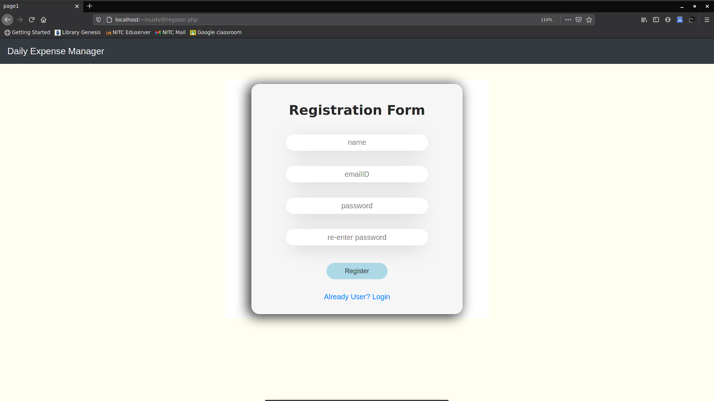

# Daily Expense Manager

This project aims to create a web application that manages the daily expenses of its users. Each user will have to register and login to use the app. Once logged in, the user will be able to see their spending logs ordered by the entry time. Clicking on an entry would provide the details associated with that expense. A separate section will allow the user to log their expenses where they may also specify the payment method used.

## Screens
* **Index Page/ Login Page**: The main page of this application for users to Login.
* **Register Page**: Page for creating new account.
* **Dashboard Page/ Home Page**: Home page for user after logging in.
* **Edit Info**: Page for editing user information.
* **View All Page**: Page for displaying all the past transactions done by the user.
    

## Database: Tables used
    * **User**: For storing all the user account informations
    * **Expense**: For storing the expense related informations
    * **Card**: For storing all the user's card informations
    

## UI: Demo Video
[!Demo video](Screenshot/ui.gif)

<h2>Screenshots</h2>
<h3> Index Page</h3>

<h3> Register Page</h3>

<h3> User Page</h3>

<h3> User Dashboard Page: Options</h3>

<h4> Dashboard: Dynamic form</h2>

    <li><h5>Payment Mode: Cash</h5></li>
    
    <li><h5>Payment Mode: Card</h5></li>
    
    <li><h5>Payment Mode: Interner Banking</h5></li>
    
<ul>

<h3> Add card Popup Dialog box</h3>

<h3> Edit Information/ Setting Page</h3>

<h3> View Past Transactions/View All Page </h3>
